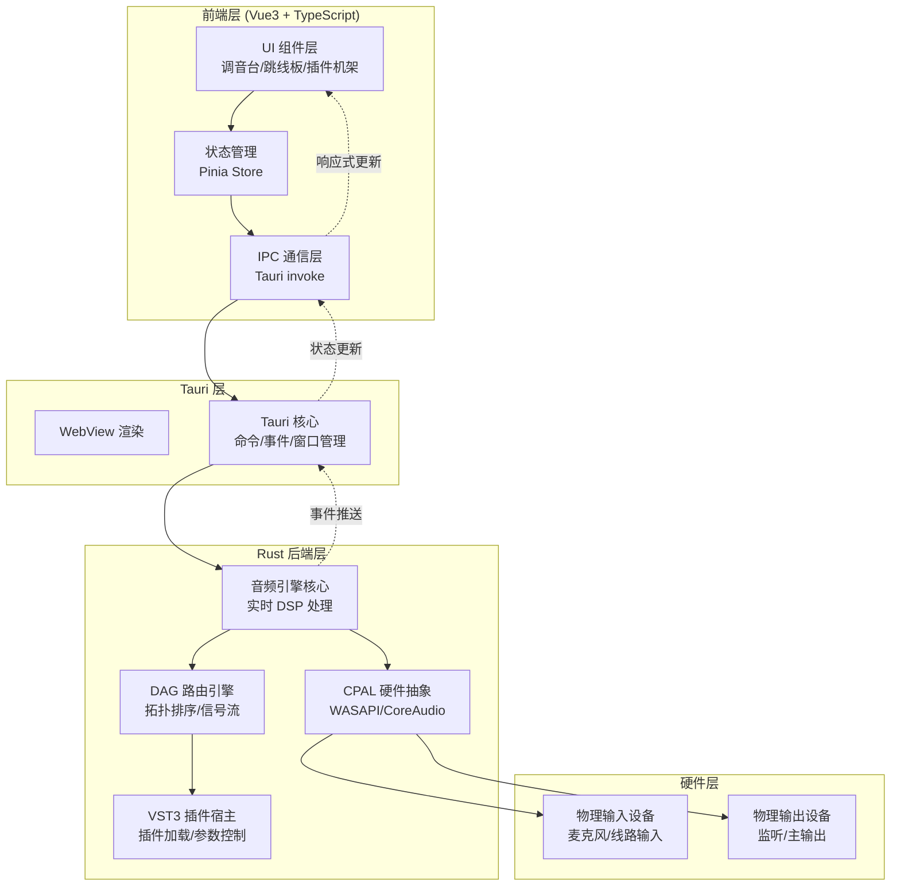

## 1. 架构设计



### 系统分层说明

1. **前端 UI 层**：Vue3 + TypeScript + Pinia，负责调音台交互、跳线板可视化、插件参数控制
2. **Tauri 中间层**：提供 IPC 通信、窗口管理、原生能力桥接
3. **音频引擎层**：Rust 编写的高性能核心，处理实时音频流、DAG 路由、VST3 插件
4. **硬件抽象层**：CPAL 库封装操作系统音频接口，实现独占式低延迟访问

## 2. 技术栈描述

### 2.1 前端技术栈
- **框架**：Vue 3.4+ with `<script setup>` + TypeScript 5.0+
- **状态管理**：Pinia 2.x
- **UI 组件**：自定义组件库（无 UI 框架依赖，工业风设计）
- **样式方案**：Tailwind CSS 3.x + CSS 变量主题系统
- **图形渲染**：HTML5 Canvas 2D（跳线板、电平表、频谱显示）
- **构建工具**：Vite 5.x
- **包管理器**：pnpm

### 2.2 Tauri 技术栈
- **Tauri**：2.0-beta
- **Rust 工具链**：stable 1.75+
- **Windows 平台**：MSVC 工具链 + Windows 10 SDK
- **macOS 平台**：Xcode Command Line Tools 15+

### 2.3 Rust 后端依赖
| 库名 | 版本 | 用途 |
|------|------|------|
| `cpal` | 0.15 | 跨平台音频 I/O |
| `vst3` | 0.1 | VST3 插件宿主 |
| `ringbuf` | 0.3 | 无锁环形缓冲区 |
| `crossbeam-channel` | 0.5 | 线程间无锁通信 |
| `petgraph` | 0.6 | DAG 图数据结构 |
| `realfft` | 3.0 | 实时 FFT 变换 |
| `biquad` | 0.5 | 双二阶滤波（EQ） |
| `serde` | 1.0 | 序列化/反序列化 |
| `tokio` | 1.0 | 异步任务运行时 |

### 2.4 目录结构

```
project-root/
├── src/                          # 前端源码
│   ├── components/               # 可复用组件
│   │   ├── mixer/               # 调音台组件
│   │   ├── patchbay/            # 跳线板组件
│   │   ├── plugins/             # 插件机架组件
│   │   └── shared/              # 通用组件（旋钮、推子、电平表）
│   ├── composables/             # Vue 组合式函数
│   │   ├── useAudioEngine.ts    # 音频引擎交互
│   │   ├── useDspControl.ts     # DSP 参数控制
│   │   └── useMixerState.ts     # 调音台状态管理
│   ├── stores/                  # Pinia 状态
│   │   ├── mixer.ts             # 调音台状态
│   │   ├── patchbay.ts          # 跳线板状态
│   │   └── plugins.ts           # 插件状态
│   ├── types/                   # TypeScript 类型定义
│   │   ├── audio.ts             # 音频相关类型
│   │   └── dag.ts               # DAG 路由类型
│   ├── utils/                   # 工具函数
│   ├── App.vue                  # 根组件
│   └── main.ts                  # 入口文件
├── src-tauri/                   # Rust 后端源码
│   ├── Cargo.toml
│   ├── src/
│   │   ├── main.rs              # Tauri 入口
│   │   ├── audio_engine/        # 音频引擎核心
│   │   │   ├── mod.rs
│   │   │   ├── engine.rs        # 音频引擎主循环
│   │   │   ├── cpal_impl.rs     # CPAL 硬件抽象
│   │   │   └── transport.rs     # 音频传输控制
│   │   ├── dag/                 # DAG 路由系统
│   │   │   ├── mod.rs
│   │   │   ├── graph.rs         # 图数据结构
│   │   │   ├── node.rs          # 节点定义
│   │   │   ├── processor.rs     # 节点处理器
│   │   │   └── topo_sort.rs     # 拓扑排序
│   │   ├── vst3_host/           # VST3 插件宿主
│   │   │   ├── mod.rs
│   │   │   ├── host.rs          # 宿主实现
│   │   │   ├── plugin.rs        # 插件实例
│   │   │   └── scanner.rs       # 插件扫描
│   │   ├── dsp/                 # DSP 处理模块
│   │   │   ├── mod.rs
│   │   │   ├── eq.rs            # 均衡器
│   │   │   ├── compressor.rs    # 压缩器
│   │   │   ├── limiter.rs       # 限制器
│   │   │   └── filter.rs        # 滤波器
│   │   ├── commands/            # Tauri 命令
│   │   │   ├── mod.rs
│   │   │   ├── audio.rs         # 音频控制命令
│   │   │   ├── patchbay.rs      # 跳线板命令
│   │   │   └── plugins.rs       # 插件管理命令
│   │   └── shared/              # 共享数据结构
│   │       ├── mod.rs
│   │       └── types.rs         # 跨端类型定义
│   └── tauri.conf.json          # Tauri 配置
├── .trae/
│   └── documents/
│       ├── prd.md               # 产品需求文档
│       └── architecture.md      # 技术架构文档（本文档）
├── package.json
├── pnpm-lock.yaml
├── tsconfig.json
├── vite.config.ts
└── tailwind.config.js
```

## 3. 核心数据结构定义

### 3.1 音频数据类型

```typescript
// src/types/audio.ts
export interface AudioDevice {
  id: string;
  name: string;
  type: 'input' | 'output';
  channels: number;
  sampleRates: number[];
  bufferSizes: number[];
  isExclusive: boolean;
}

export interface AudioConfig {
  inputDevice: string;
  outputDevice: string;
  sampleRate: number;
  bufferSize: number;
  exclusiveMode: boolean;
}

export interface ChannelState {
  id: number;
  name: string;
  gain: number;           // -60 ~ +12 dB
  mute: boolean;
  solo: boolean;
  pan: number;            // -1.0 ~ +1.0
  fader: number;          // 0.0 ~ 1.0
  phaseInvert: boolean;
  phantomPower: boolean;
  highPassFilter: {
    enabled: boolean;
    frequency: number;    // 20 ~ 2000 Hz
  };
  meterLevel: [number, number]; // [peak, rms]
  plugins: PluginInstance[];
}

export interface AudioStats {
  cpuUsage: number;
  xruns: number;           // 缓冲区欠载次数
  latency: number;         // 端到端延迟 ms
  sampleRate: number;
  actualBufferSize: number;
  dspLoad: number;         // DSP 处理负载 0~1
}
```

### 3.2 DAG 路由类型

```typescript
// src/types/dag.ts
export type NodeType = 'input' | 'output' | 'plugin' | 'mix' | 'send' | 'gain';

export interface Port {
  id: string;
  nodeId: string;
  type: 'input' | 'output';
  channel: number;
  name: string;
}

export interface Node {
  id: string;
  type: NodeType;
  name: string;
  position: { x: number; y: number };
  inputPorts: Port[];
  outputPorts: Port[];
  config: Record<string, any>;
  enabled: boolean;
  bypassed: boolean;
}

export interface Connection {
  id: string;
  sourcePort: string;
  targetPort: string;
  sourceNode: string;
  targetNode: string;
  gain: number;
}

export interface PatchbayState {
  nodes: Node[];
  connections: Connection[];
  selectedNode: string | null;
  selectedConnection: string | null;
}
```

### 3.3 插件类型

```typescript
// src/types/plugins.ts
export interface PluginInfo {
  id: string;
  name: string;
  vendor: string;
  category: 'EQ' | 'Compressor' | 'Reverb' | 'Delay' | 'Utility';
  version: string;
  path: string;
  pluginFormat: 'VST3';
  hasEditor: boolean;
  inputBusCount: number;
  outputBusCount: number;
}

export interface PluginParameter {
  id: string;
  name: string;
  value: number;
  min: number;
  max: number;
  defaultValue: number;
  steps: number;
  unit: string;
  isBypass: boolean;
  isAutomated: boolean;
}

export interface PluginInstance {
  instanceId: string;
  pluginId: string;
  parameters: PluginParameter[];
  bypassed: boolean;
  enabled: boolean;
  preset: string | null;
}
```

### 3.4 Rust 端共享类型

```rust
// src-tauri/src/shared/types.rs
use serde::{Serialize, Deserialize};

#[derive(Debug, Clone, Serialize, Deserialize)]
pub struct AudioBlock {
    pub sample_rate: f32,
    pub buffer_size: usize,
    pub channels: usize,
    pub data: Vec<Vec<f32>>,  // [channel][sample]
    pub timestamp: u64,
}

#[derive(Debug, Clone, Serialize, Deserialize)]
pub enum NodeProcessorKind {
    Input,
    Output,
    Mix,
    Gain,
    Vst3 { plugin_id: String },
    Eq { bands: Vec<EqBand> },
    Compressor { params: CompressorParams },
}

#[derive(Debug, Clone, Serialize, Deserialize)]
pub struct EqBand {
    pub frequency: f32,
    pub gain: f32,
    pub q: f32,
    pub band_type: EqBandType,
    pub enabled: bool,
}

#[derive(Debug, Clone, Serialize, Deserialize)]
pub enum EqBandType {
    LowShelf,
    HighShelf,
    Bell,
    Notch,
    HighPass,
    LowPass,
}

#[derive(Debug, Clone, Serialize, Deserialize)]
pub struct CompressorParams {
    pub threshold: f32,    // dB
    pub ratio: f32,        // 1:1 ~ 20:1
    pub attack: f32,       // ms
    pub release: f32,      // ms
    pub makeup_gain: f32,  // dB
    pub knee_width: f32,   // dB
}
```

## 4. 核心模块设计

### 4.1 音频引擎模块

**职责**：管理音频流生命周期，协调 CPAL 硬件访问与 DSP 处理

```rust
// src-tauri/src/audio_engine/engine.rs
pub struct AudioEngine {
    config: AudioConfig,
    stream: Option<Stream>,
    processor_graph: Arc<RwLock<DAGProcessor>>,
    input_buffer: Arc<RingBuffer<f32>>,
    output_buffer: Arc<RingBuffer<f32>>,
    stats: Arc<Mutex<AudioStats>>,
    event_sender: crossbeam_channel::Sender<EngineEvent>,
}

impl AudioEngine {
    pub fn start(&mut self) -> Result<()> {
        // 1. 配置 CPAL 输入流（独占模式）
        let input_stream = self.build_input_stream()?;
        // 2. 配置 CPAL 输出流
        let output_stream = self.build_output_stream()?;
        // 3. 启动处理线程
        self.start_processing_thread();
        // 4. 启动流
        input_stream.play()?;
        output_stream.play()?;
        Ok(())
    }

    fn audio_processing_loop(&self) {
        loop {
            // 无锁读取输入环形缓冲
            if let Some(block) = self.input_buffer.read_block() {
                // 执行 DAG 处理
                let processed = self.processor_graph.read().unwrap().process(block);
                // 写入输出环形缓冲
                self.output_buffer.write_block(processed);
                // 更新性能统计
                self.update_stats();
            }
        }
    }
}
```

### 4.2 DAG 路由引擎

**职责**：管理音频信号流拓扑，执行节点处理

```rust
// src-tauri/src/dag/graph.rs
pub struct DAGProcessor {
    graph: Graph<Node, Edge>,
    execution_order: Vec<NodeId>,
    node_processors: HashMap<NodeId, Box<dyn NodeProcessor>>,
}

impl DAGProcessor {
    pub fn process(&mut self, input: AudioBlock) -> AudioBlock {
        // 1. 拓扑排序确定执行顺序
        let order = self.topological_sort()?;
        
        // 2. 初始化节点数据缓冲区
        let mut node_outputs: HashMap<NodeId, AudioBlock> = HashMap::new();
        
        // 3. 按拓扑顺序执行每个节点
        for node_id in order {
            let inputs = self.collect_node_inputs(node_id, &node_outputs);
            let processor = self.node_processors.get_mut(&node_id).unwrap();
            let output = processor.process(inputs);
            node_outputs.insert(node_id, output);
        }
        
        // 4. 返回输出节点结果
        Ok(self.get_final_output(&node_outputs))
    }

    pub fn add_node(&mut self, node: Node) -> Result<NodeId> {
        // 添加节点并重建执行顺序
        let id = self.graph.add_node(node);
        self.update_execution_order()?;
        Ok(id)
    }

    pub fn connect(&mut self, from: NodeId, to: NodeId, gain: f32) -> Result<()> {
        // 检查是否会形成环
        self.graph.add_edge(from, to, Edge { gain });
        self.update_execution_order()
    }
}
```

### 4.3 VST3 插件宿主

**职责**：扫描、加载和管理 VST3 插件

```rust
// src-tauri/src/vst3_host/host.rs
pub struct Vst3Host {
    plugin_registry: HashMap<String, PluginInfo>,
    loaded_plugins: HashMap<String, PluginInstance>,
}

impl Vst3Host {
    pub fn scan_plugins(&mut self) -> Result<Vec<PluginInfo>> {
        // 扫描标准 VST3 目录
        // Windows: C:\Program Files\Common Files\VST3
        // macOS: /Library/Audio/Plug-Ins/VST3
        let mut plugins = Vec::new();
        for path in self.get_plugin_paths() {
            if let Ok(info) = self.load_plugin_info(&path) {
                self.plugin_registry.insert(info.id.clone(), info.clone());
                plugins.push(info);
            }
        }
        Ok(plugins)
    }

    pub fn create_instance(&mut self, plugin_id: &str) -> Result<String> {
        let info = self.plugin_registry.get(plugin_id)
            .ok_or_else(|| Error::PluginNotFound)?;
        
        // 加载动态库
        let library = unsafe { Library::new(&info.path) }?;
        
        // 获取 VST3 工厂函数
        let factory = library.get::<PluginFactory>()?;
        
        // 创建组件实例
        let component = factory.create_instance(&info.cid)?;
        
        // 初始化处理上下文
        component.initialize(&self.host_context)?;
        
        let instance_id = Uuid::new_v4().to_string();
        self.loaded_plugins.insert(instance_id.clone(), PluginInstance {
            info: info.clone(),
            component,
            active: false,
            processor: None,
        });
        
        Ok(instance_id)
    }

    pub fn set_active(&mut self, instance_id: &str, active: bool) -> Result<()> {
        let instance = self.loaded_plugins.get_mut(instance_id)?;
        if active {
            // 激活插件，设置处理属性
            instance.component.set_active(true)?;
            instance.processor = Some(instance.component.get_audio_processor()?);
        } else {
            instance.component.set_active(false)?;
            instance.processor = None;
        }
        instance.active = active;
        Ok(())
    }
}

// 插件处理节点实现
pub struct Vst3ProcessorNode {
    instance_id: String,
    host: Arc<Mutex<Vst3Host>>,
    bypassed: bool,
}

impl NodeProcessor for Vst3ProcessorNode {
    fn process(&mut self, inputs: Vec<AudioBlock>) -> AudioBlock {
        if self.bypassed {
            return inputs[0].clone();
        }
        
        let host = self.host.lock().unwrap();
        let instance = host.loaded_plugins.get(&self.instance_id).unwrap();
        
        if let Some(processor) = &instance.processor {
            // 准备处理数据
            let mut process_data = ProcessData::new();
            process_data.num_samples = inputs[0].buffer_size;
            process_data.inputs = self.convert_to_vst3_buffers(&inputs);
            process_data.outputs = self.allocate_output_buffers(inputs[0].buffer_size);
            
            // 执行插件处理
            processor.process(&process_data);
            
            // 转换回内部格式
            self.convert_from_vst3_buffers(&process_data.outputs)
        } else {
            inputs[0].clone()
        }
    }
}
```

### 4.4 DSP 处理模块

**职责**：内置 DSP 算法实现（EQ、压缩器、限制器）

```rust
// src-tauri/src/dsp/eq.rs
pub struct ParametricEq {
    bands: Vec<EqBand>,
    filters: Vec<Biquad>,
    sample_rate: f32,
}

impl ParametricEq {
    pub fn new(sample_rate: f32, bands: Vec<EqBand>) -> Self {
        let filters = bands.iter()
            .map(|band| Self::create_filter(band, sample_rate))
            .collect();
        Self { bands, filters, sample_rate }
    }

    fn create_filter(band: &EqBand, sample_rate: f32) -> Biquad {
        match band.band_type {
            EqBandType::Bell => Biquad::peaking_eq(
                sample_rate, band.frequency, band.q, band.gain
            ),
            EqBandType::LowShelf => Biquad::low_shelf(
                sample_rate, band.frequency, band.q, band.gain
            ),
            EqBandType::HighShelf => Biquad::high_shelf(
                sample_rate, band.frequency, band.q, band.gain
            ),
            EqBandType::HighPass => Biquad::high_pass(
                sample_rate, band.frequency, band.q
            ),
            EqBandType::LowPass => Biquad::low_pass(
                sample_rate, band.frequency, band.q
            ),
            EqBandType::Notch => Biquad::notch(
                sample_rate, band.frequency, band.q
            ),
        }
    }

    pub fn process_block(&mut self, block: &mut AudioBlock) {
        for channel in 0..block.channels {
            for sample in 0..block.buffer_size {
                let mut x = block.data[channel][sample];
                for filter in &mut self.filters {
                    x = filter.process(x);
                }
                block.data[channel][sample] = x;
            }
        }
    }
}

// src-tauri/src/dsp/compressor.rs
pub struct Compressor {
    params: CompressorParams,
    envelope_follower: EnvelopeFollower,
    gain_reduction: f32,
    sample_rate: f32,
}

impl Compressor {
    pub fn process_block(&mut self, block: &mut AudioBlock) {
        for sample in 0..block.buffer_size {
            // 计算立体声峰值
            let peak = block.data.iter()
                .map(|ch| ch[sample].abs())
                .fold(0.0_f32, f32::max);
            
            // 转换为 dB
            let peak_db = if peak > 0.0 { 
                20.0 * peak.log10() 
            } else { 
                -120.0 
            };
            
            // 计算增益衰减量
            let overshoot = peak_db - self.params.threshold;
            let target_gr = if overshoot > 0.0 {
                -overshoot * (self.params.ratio - 1.0) / self.params.ratio
            } else {
                0.0
            };
            
            // 平滑增益衰减（攻击/释放）
            let coeff = if target_gr < self.gain_reduction {
                self.attack_coeff()
            } else {
                self.release_coeff()
            };
            self.gain_reduction += coeff * (target_gr - self.gain_reduction);
            
            // 应用增益
            let gain_db = self.gain_reduction + self.params.makeup_gain;
            let gain_linear = 10.0_f32.powf(gain_db / 20.0);
            
            for channel in 0..block.channels {
                block.data[channel][sample] *= gain_linear;
            }
        }
    }
}
```

## 5. IPC 通信协议

### 5.1 Tauri 命令定义

```typescript
// src/composables/useAudioEngine.ts
export interface AudioEngineAPI {
  // 音频控制
  startEngine(): Promise<boolean>;
  stopEngine(): Promise<boolean>;
  getDevices(): Promise<AudioDevice[]>;
  getConfig(): Promise<AudioConfig>;
  setConfig(config: AudioConfig): Promise<boolean>;
  getStats(): Promise<AudioStats>;
  
  // 跳线板控制
  getPatchbay(): Promise<PatchbayState>;
  addNode(node: Omit<Node, 'id'>): Promise<Node>;
  removeNode(nodeId: string): Promise<boolean>;
  connectPorts(sourcePort: string, targetPort: string): Promise<Connection>;
  disconnect(connectionId: string): Promise<boolean>;
  updateNodePosition(nodeId: string, x: number, y: number): Promise<boolean>;
  setNodeBypass(nodeId: string, bypassed: boolean): Promise<boolean>;
  
  // 插件管理
  scanPlugins(): Promise<PluginInfo[]>;
  loadPlugin(pluginId: string): Promise<PluginInstance>;
  unloadPlugin(instanceId: string): Promise<boolean>;
  setPluginParameter(instanceId: string, paramId: string, value: number): Promise<boolean>;
  setPluginBypass(instanceId: string, bypassed: boolean): Promise<boolean>;
  
  // 通道控制
  setChannelGain(channel: number, gain: number): Promise<boolean>;
  setChannelFader(channel: number, fader: number): Promise<boolean>;
  setChannelMute(channel: number, muted: boolean): Promise<boolean>;
  setChannelSolo(channel: number, solo: boolean): Promise<boolean>;
  setChannelPan(channel: number, pan: number): Promise<boolean>;
}
```

### 5.2 事件推送

Rust 端通过 Tauri 事件向前端推送实时状态：

```rust
// src-tauri/src/audio_engine/engine.rs
pub enum EngineEvent {
    LevelUpdate {
        channel_levels: Vec<(f32, f32)>, // (peak, rms) per channel
        main_levels: (f32, f32),
    },
    StatsUpdate(AudioStats),
    XrunOccurred { count: u32 },
    Clipping { channels: Vec<usize> },
    PluginStatus { instance_id: String, active: bool },
}
```

前端通过事件监听接收：

```typescript
// src/composables/useAudioEngine.ts
import { listen } from '@tauri-apps/api/event';

function setupEventListeners() {
  listen('audio-levels', (event) => {
    const data = event.payload as {
      channelLevels: [number, number][];
      mainLevels: [number, number];
    };
    store.updateLevels(data);
  });

  listen('audio-stats', (event) => {
    store.updateStats(event.payload as AudioStats);
  });

  listen('xrun-warning', (event) => {
    console.warn('Buffer underrun:', event.payload);
  });
}
```

## 6. 关键技术实现策略

### 6.1 低延迟保障
1. **CPAL 独占模式**：使用 `cpal::StreamConfig` 的 `exclusive` 选项，绕过操作系统音频混合
2. **小缓冲区**：支持 32/64/128/256 样点缓冲区，配合实时线程优先级
3. **无锁数据结构**：使用 `ringbuf` 和 `crossbeam-channel` 实现线程间无锁通信
4. **内存预分配**：启动时预分配所有音频缓冲区，处理时避免动态分配
5. **实时线程优先级**：使用 `thread_priority` 库将音频线程提升为实时优先级

### 6.2 DAG 实时重配置
1. **双缓冲图结构**：使用读写锁保护 DAG，配置更新时构建新图然后原子切换
2. **拓扑排序缓存**：只在图结构变化时重新排序，处理时直接使用缓存顺序
3. **节点旁路机制**：节点可被旁路，处理时直接跳过不影响整体延迟

### 6.3 VST3 插件安全
1. **插件沙箱**：每个插件在独立的线程中运行，崩溃时自动隔离
2. **异常处理**：使用 `catch_unwind` 捕获插件处理中的 panic
3. **处理超时**：设置单块处理超时（10ms），超时自动旁路插件

### 6.4 前端性能优化
1. **Canvas 硬件加速**：电平表、频谱图使用 Canvas 2D 渲染，60fps 更新
2. **状态批处理**：Pinia 状态更新合并，避免频繁重渲染
3. **虚拟列表**：插件列表和通道列表使用虚拟滚动
4. **WebWorker**：重型计算（如波形分析）在 WebWorker 中执行

## 7. 构建与部署

### 7.1 开发环境
- Node.js 18+
- Rust 1.75+ stable
- Windows: Visual Studio Build Tools 2022 + Windows 10 SDK
- macOS: Xcode 15+ Command Line Tools

### 7.2 构建命令
```json
{
  "scripts": {
    "dev": "tauri dev",
    "build": "tauri build",
    "build:release": "tauri build --release",
    "lint": "eslint . --ext .ts,.vue",
    "type-check": "vue-tsc --noEmit",
    "test:rust": "cargo test --manifest-path src-tauri/Cargo.toml"
  }
}
```

### 7.3 发布产物
- Windows: `.msi` 安装包 + `.exe` 便携版
- macOS: `.dmg` 磁盘映像 + `.app` 应用包
