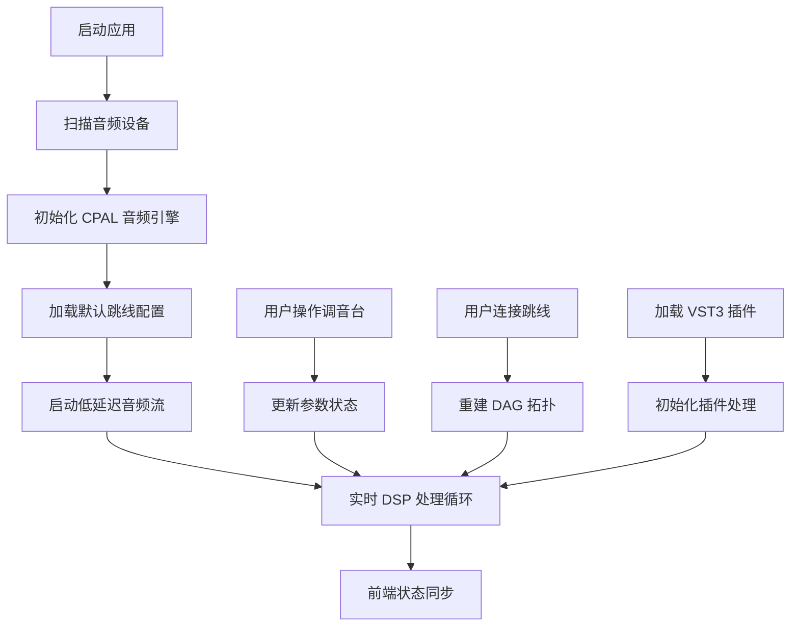

## 1. 产品概述

本产品是一款专为广电直播车现场调音设计的跨平台数字音频工作站（DAW），通过 Tauri 桌面框架结合 Rust 高性能音频引擎，实现广播级低延迟音频处理。系统支持多通道物理输入、DAG 虚拟跳线路由、VST3 插件实时处理，满足户外直播、现场演出等专业场景的严苛要求。

- **核心价值**：在移动直播环境中提供专业级音频调音能力，延迟 < 5ms，支持多路麦克风输入与灵活的音频路由
- **目标用户**：广电直播工程师、现场音响师、户外转播团队
- **技术壁垒**：Rust 编写的高性能音频引擎、CPAL 底层硬件接管、DAG 实时音频路由、VST3 插件宿主

## 2. 核心功能

### 2.1 用户角色

| 角色 | 注册方式 | 核心权限 |
|------|----------|----------|
| 音响工程师 | 本地应用启动 | 完整调音台控制、跳线路由配置、插件管理、系统设置 |
| 直播操作员 | 本地应用启动 | 通道电平监控、常用场景切换、录音控制 |

### 2.2 功能模块

1. **调音台主界面**：多通道轨道控制、电平表、推子、静音/独奏、声像调节
2. **虚拟跳线板**：DAG 可视化音频路由、物理输入到虚拟轨道映射、信号路径显示
3. **插件机架**：VST3 插件加载管理、EQ 均衡器控制、压缩器动态处理
4. **系统设置**：音频设备选择、缓冲区大小配置、采样率设置、延迟监控
5. **录音与回放**：多通道录音、波形预览、场景快照保存/加载

### 2.3 页面详情

| 页面名称 | 模块名称 | 功能描述 |
|----------|----------|----------|
| 调音台主界面 | 轨道控制区 | 8 路虚拟轨道推子、静音/独奏按钮、声像旋钮、电平峰值表 |
| 调音台主界面 | 主输出区 | 立体声主输出控制、限制器、总电平表、相位表 |
| 调音台主界面 | 通道条 | 单路通道详细控制：增益、48V 幻象电源、高通滤波、插入效果 |
| 虚拟跳线板 | 路由画布 | DAG 可视化编辑，拖拽连接物理输入到虚拟轨道 |
| 虚拟跳线板 | 节点管理 | 输入节点、输出节点、插件节点、混合节点的创建与删除 |
| 插件机架 | 插件列表 | 已扫描 VST3 插件库、分类筛选、快速加载 |
| 插件机架 | 参数控制 | 插件原生 UI 嵌入、参数自动化、预设管理 |
| 系统设置 | 音频配置 | WASAPI/CoreAudio 设备选择、独占模式、缓冲区 32-256 样点 |
| 系统设置 | 性能监控 | CPU 使用率、实时延迟、缓冲区欠载计数、采样率偏移 |

## 3. 核心流程

**音频处理流程**：
1. 物理麦克风输入 → CPAL 采集 → 环形缓冲队列
2. DAG 遍历执行：输入节点 → 增益/滤波 → EQ 插件 → 压缩器插件 → 混合节点
3. 混合输出 → 限制器 → CPAL 回放 → 物理输出设备
4. 全程采用无锁队列实现线程间通信，确保 < 5ms 端到端延迟

## 4. 用户界面设计

### 4.1 设计风格

- **设计方向**：专业广播级深色工业风，强调功能性与可读性
- **主色调**：深灰 `#1a1a1e` 背景、炭黑 `#121217` 面板、广播红 `#ff3b3b` 峰值警告
- **辅助色**：电平绿 `#00ff88`、信号蓝 `#00a8ff`、 solo 黄 `#ffcc00`
- **字体**：显示字体采用 `Space Mono`（等宽技术感），正文采用 `Inter`
- **按钮风格**：方形微倒角、按压下沉效果、LED 指示灯状态
- **布局风格**：模块化面板布局、可拖拽分区、精确像素对齐
- **图标风格**：线性 SVG 图标、单色填充、状态变色反馈

### 4.2 页面设计概述

| 页面名称 | 模块名称 | UI 元素 |
|----------|----------|----------|
| 调音台主界面 | 轨道控制区 | 垂直推子（1000px 行程）、12 段 LED 电平表、圆形静音/独奏按钮 |
| 调音台主界面 | 主输出区 | 双通道大型 VU 表、峰值保持显示、限制器增益衰减表 |
| 虚拟跳线板 | 路由画布 | 网格背景、节点端口、贝塞尔曲线连接线、信号流向动画 |
| 插件机架 | 参数控制 | 旋钮控件、滑块、频谱显示、压缩曲线可视化 |
| 系统设置 | 性能监控 | 实时波形图、延迟抖动直方图、CPU 负载条 |

### 4.3 响应式设计

- **桌面优先**：主界面针对 1920×1080 及以上分辨率优化
- **窗口缩放**：支持 0.75x - 1.5x 无级缩放，所有控件矢量渲染
- **面板管理**：支持面板浮动、停靠、最小化，适应多显示器工作流
- **触控优化**：推子和按钮支持触控操作，最小触控目标 40×40px

### 4.4 动效与交互

- **电平表动画**：60fps 实时更新，峰值保持 2 秒衰减
- **推子交互**：拖拽时有加速度跟随，双击归零
- **跳线连接**：拖拽时连接线半透明预览，吸附到端口时高亮
- **旋钮控制**：圆形旋转手势，支持精确值输入
- **过载警告**：峰值削波时红色闪烁，边框脉动

## 5. 非功能需求

### 5.1 性能要求
- **端到端延迟**：缓冲区 64 样点时 < 5ms，128 样点时 < 10ms
- **处理能力**：8 路输入 + 8 路 VST3 插件时 CPU 占用 < 20%（现代多核 CPU）
- **稳定性**：7×24 小时连续运行无崩溃，缓冲区欠载率 < 0.001%
- **采样率**：支持 44.1kHz / 48kHz / 96kHz / 192kHz

### 5.2 兼容性
- **操作系统**：Windows 10/11 (x64/ARM64)、macOS 11+ (Intel/Apple Silicon)
- **音频接口**：WASAPI 独占模式、CoreAudio、ASIO（可选）
- **插件格式**：VST3 3.7+ 64 位插件

### 5.3 安全与隐私
- 所有配置本地存储，无网络连接要求
- 音频数据不写入磁盘除非用户主动录音
- 插件沙箱运行，防止第三方插件崩溃影响宿主
